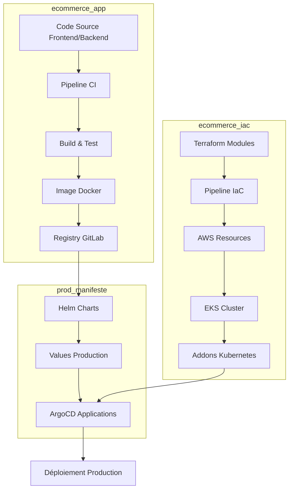
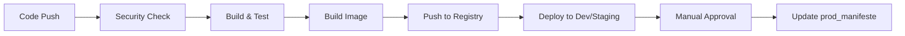
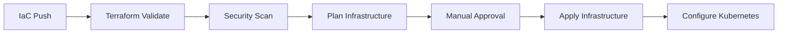

# Architecture DevOps E-commerce Microservices

[](https://www.terraform.io/)
[](https://about.gitlab.com/)
[](https://kubernetes.io/)
[](https://argo-cd.readthedocs.io/)
[](https://prometheus.io/)

## 📋 Vue d'ensemble du projet

Ce projet implémente une architecture DevOps complète pour une application e-commerce basée sur des microservices. L'architecture est organisée en trois parties distinctes, chacune avec un rôle spécifique dans le cycle de vie de l'application:

1. **[/ecommerce_app](/ecommerce_app)** - Code source de l'application et pipelines CI
2. **[/ecommerce_iac](/ecommerce_iac)** - Infrastructure as Code et automation
3. **[/prod_manifeste](/prod_manifeste)** - Manifestes Kubernetes pour le déploiement GitOps

Cette approche modulaire permet une séparation claire des responsabilités et facilite la maintenance et l'évolution de chaque composant.

## 🏗️ Architecture globale

```
📂 ecommerce-project
┣━━ 📂 ecommerce_app          # Code source et CI
┃    ┣━━ 📂 frontend          # Application React
┃    ┣━━ 📂 microservices     # Services backend
┃    ┗━━ 📂 .gitlab-ci.yml    # Pipeline CI/CD
┃
┣━━ 📂 ecommerce_iac          # Infrastructure as Code
┃    ┣━━ 📂 terraform         # Modules Terraform AWS
┃    ┣━━ 📂 scripts           # Scripts d'automatisation
┃    ┗━━ 📂 .gitlab-ci.yml    # Pipeline IaC
┃
┗━━ 📂 prod_manifeste         # Manifestes de production
     ┣━━ 📂 charts            # Charts Helm
     ┣━━ 📂 values            # Fichiers de valeurs
     ┗━━ 📂 argocd            # Configurations ArgoCD
```

### Flux de travail entre les composants



## 📦 Description des composants

### 1. ecommerce_app

Ce module contient le code source de l'application e-commerce microservices et les pipelines CI pour la construction et les tests.

**Contenu principal:**
- Code source frontend React
- Microservices backend (Customers, Products, Shopping)
- Dockerfiles optimisés
- Pipeline GitLab CI pour le build, les tests et la sécurité
- Chart Helm pour les environnements de développement et staging

**Technologies clés:**
- React (Frontend)
- Node.js (Backend)
- MongoDB
- RabbitMQ
- Docker
- Helm

[Voir le dossier ecommerce_app →](/ecommerce_app)

### 2. ecommerce_iac

Ce module contient toute l'infrastructure as code (IaC) nécessaire pour provisionner et maintenir l'environnement cloud.

**Contenu principal:**
- Modules Terraform pour AWS
- Pipeline GitLab CI pour l'automatisation de l'infrastructure
- Scripts de configuration et d'initialisation
- Manifestes Kubernetes pour les composants d'infrastructure

**Modules Terraform:**
- **VPC & Réseau**: Subnets, Internet Gateway, NAT Gateway
- **EKS**: Cluster Kubernetes, groupes de nœuds, IRSA
- **IAM**: Rôles et politiques pour les services AWS
- **S3**: Buckets pour les backups, logs et états Terraform
- **Helm**: Charts pour les composants d'infrastructure

**Composants déployés via Helm:**
- NGINX Ingress Controller
- Cert-Manager
- Prometheus & Grafana
- Velero (Backups)
- Fluentd (Logging)
- ArgoCD

[Voir le dossier ecommerce_iac →](/ecommerce_iac)

### 3. prod_manifeste

Ce module contient les manifestes Kubernetes et les configurations pour le déploiement en production via GitOps.

**Contenu principal:**
- Charts Helm pour l'application et les services
- Fichiers de valeurs spécifiques à la production
- Configurations ArgoCD
- Manifestes de sécurité (NetworkPolicies, RBAC, etc.)

**Particularités:**
- Ce composant est la source de vérité pour l'état de production
- ArgoCD synchronise automatiquement les changements avec le cluster
- Les modifications suivent un workflow GitOps strict avec approbations

[Voir le dossier prod_manifeste →](/prod_manifeste)

## 🔄 Flux CI/CD et GitOps

Le système utilise deux pipelines principaux:

### Pipeline Application (ecommerce_app)



### Pipeline Infrastructure (ecommerce_iac)



### Workflow GitOps (prod_manifeste)

1. La mise à jour du dossier `prod_manifeste` est déclenchée par:
   - Approbation manuelle après tests en staging
   - Modifications d'infrastructure nécessitant des changements en production

2. ArgoCD détecte les changements et:
   - Compare l'état souhaité (Git) avec l'état actuel (Cluster)
   - Planifie et exécute la synchronisation
   - Applique les changements dans le cluster de production

## 🔒 Sécurité et bonnes pratiques

- **Gestion des secrets**: SealedSecrets pour chiffrer les secrets dans Git
- **Infrastructure sécurisée**: VPC privé, configurations restrictives du groupe de sécurité
- **IAM**: Principe du moindre privilège avec IRSA (IAM Roles for Service Accounts)
- **CI/CD sécurisée**: Scan des images Docker, validation des manifestes Kubernetes
- **Observabilité**: Monitoring avec Prometheus/Grafana, centralisation des logs avec Fluentd
- **Backups**: Sauvegardes automatisées avec Velero vers S3

## 📊 Monitoring et Observabilité

L'infrastructure inclut un stack complet de monitoring:

- **Métriques**: Prometheus pour la collecte de métriques
- **Visualisation**: Dashboards Grafana pour le monitoring en temps réel
- **Alertes**: Configuration Alertmanager pour les notifications
- **Logs**: Centralisation des logs avec Fluentd vers S3
- **Traçabilité**: Intégration potentielle avec OpenTelemetry (en cours)

## 🛠️ Guide de développement

### Prérequis

- Docker et Docker Compose
- Terraform 1.0+
- kubectl et Helm
- Accès AWS (pour l'infrastructure complète)
- GitLab CLI (facultatif)

### Workflow de développement

1. **Cloner le dépôt**:
   ```bash
   git clone https://github.com/yourusername/ecommerce-project.git
   cd ecommerce-project
   ```

2. **Démarrer l'environnement local**:
   ```bash
   cd ecommerce_app
   docker-compose up -d
   ```

3. **Développer et tester localement**:
   - Modifier le code dans `ecommerce_app`
   - Exécuter les tests unitaires et d'intégration
   - Vérifier les changements en local

4. **Pipeline CI**:
   - Pousser les changements pour déclencher le pipeline GitLab CI
   - Vérifier les résultats du pipeline (tests, builds, scan)

5. **Déploiement en développement/staging**:
   - Le pipeline déploie automatiquement dans les environnements non-production
   - Tester les changements dans ces environnements

6. **Promotion en production**:
   - Approuver la promotion en production
   - Le pipeline met à jour les fichiers dans `prod_manifeste`
   - ArgoCD synchronise les changements avec le cluster de production

## 🚀 Environnements de déploiement

Le projet supporte trois environnements distincts:

### Développement
- **Hébergement**: VM locale avec K3s
- **Objectif**: Développement rapide et tests
- **Déploiement**: Automatique via pipeline CI
- **Configuration**: `values-dev.yaml`

### Staging
- **Hébergement**: VM locale avec K3s (namespace isolé)
- **Objectif**: Tests d'intégration et validation
- **Déploiement**: Automatique après succès en développement
- **Configuration**: `values-staging.yaml`

### Production
- **Hébergement**: AWS EKS
- **Objectif**: Environnement client final
- **Déploiement**: GitOps avec ArgoCD après approbation manuelle
- **Configuration**: `values-prod.yaml`

## 🌱 Perspectives d'évolution

- Implémentation de déploiements Canary/Blue-Green avec Argo Rollouts
- Intégration d'une solution de mesh service (Istio ou Linkerd)
- Expansion des tests automatisés (tests de charge, tests E2E)
- Mise en place d'une stratégie de disaster recovery complète
- Migration vers une architecture event-driven plus complète

## 📚 Documentation additionnelle

- [Guide d'architecture détaillé](/docs/architecture.md)
- [Manuel des opérations](/docs/operations.md)
- [Procédures de déploiement](/docs/deployment.md)
- [Guide de résolution des problèmes](/docs/troubleshooting.md)

## 👥 Contribution

Les contributions sont les bienvenues! Veuillez consulter nos [guidelines de contribution](./CONTRIBUTING.md) avant de soumettre une Pull Request.

## 📄 Licence

Ce projet est sous licence [MIT](./LICENSE).