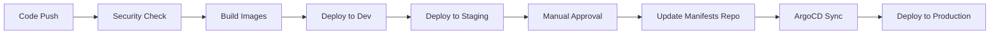

# E-commerce Microservices Application

## Overview

This repository contains the application code and deployment configurations for a microservices-based e-commerce platform, designed with a focus on DevOps best practices. The application allows users to browse products, manage shopping carts, and process customer information through a modern React frontend and a set of specialized backend services.

## Architecture

The application follows a microservices architecture with the following components:

### Frontend
- **App Service**: React-based web interface for the e-commerce platform

### Backend Microservices
- **Customers Service**: Manages customer accounts, authentication, and profiles
- **Products Service**: Handles product catalog, inventory, and product information
- **Shopping Service**: Processes shopping carts and ordering functionality

### Infrastructure Components
- **MongoDB**: NoSQL database used by each microservice
- **RabbitMQ**: Message broker for inter-service communication
- **Nginx Ingress**: Manages external access to services

## CI/CD Pipeline

The application uses a GitLab CI/CD pipeline for continuous integration and deployment:



### Pipeline Features:
- **Automated Testing**: Code is tested at every stage
- **Image Scanning**: Docker images are scanned for vulnerabilities using Checkov
- **GitOps Workflow**: Production deployments via ArgoCD
- **Multi-Environment**: Supports dev, staging, and production environments

## Technology Stack

- **Frontend**: React
- **Backend**: Node.js
- **Databases**: MongoDB
- **Messaging**: RabbitMQ
- **Containerization**: Docker
- **Orchestration**: Kubernetes
- **Helm Charts**: For package management and deployment
- **CI/CD**: GitLab CI
- **GitOps**: ArgoCD
- **Monitoring**: Prometheus & Grafana
- **Logging**: Fluentd

## Deployment

The application is deployed on Kubernetes using Helm charts for package management. Different environments use different configuration values:

- **Development**: Local VM with K3s
- **Staging**: Local VM with K3s (isolated namespace)
- **Production**: AWS EKS Cluster

### Helm Chart Structure

```
charts/
├── templates/
│   ├── app/
│   ├── customers/
│   ├── products/
│   ├── shopping/
│   ├── mongodb/
│   └── ingress/
└── values/
    ├── values-dev.yaml
    ├── values-staging.yaml
    └── values-prod.yaml
```

##  Security Features

- **Sealed Secrets**: For secure storage of credentials in Git
- **RBAC**: Role-based access control in Kubernetes
- **Network Policies**: Service isolation
- **Image Scanning**: Vulnerability detection in container images
- **IAM Roles**: For service accounts in production (AWS)

##  Monitoring & Observability

- **Metrics**: Prometheus collects performance data from all services
- **Visualization**: Grafana dashboards display system and application metrics
- **Alerting**: Prometheus Alertmanager for notifications
- **Logging**: Centralized logging with Fluentd to S3

##  Getting Started

### Prerequisites
- Docker and Docker Compose
- Kubernetes cluster (or Minikube/K3s for local development)
- Helm
- kubectl

### Local Development Setup

1. Clone the repository:
   ```bash
   git clone https://github.com/yourusername/ecommerce-microservices.git
   cd ecommerce-microservices
   ```

2. Start the development environment:
   ```bash
   docker-compose up -d
   ```

3. Access the application:
   ```
   Frontend: http://localhost
   Customers API: http://localhost:8001
   Products API: http://localhost:8002
   Shopping API: http://localhost:8003
   ```

### Kubernetes Deployment

1. Add the Helm repository:
   ```bash
   helm repo add my-ecommerce https://your-helm-repo.com
   helm repo update
   ```

2. Install the application:
   ```bash
   helm install ecommerce my-ecommerce/ecommerce-app -f values-dev.yaml
   ```

## Future Improvements

- Implement comprehensive unit and integration testing
- Enhance the rollback strategy for zero-downtime deployments
- Implement a more advanced versioning system for Docker images
- Expand linting and code quality checks
- Add canary deployments for safer releases

##  License

This project is licensed under the MIT License - see the LICENSE file for details.

##  Contributing

Contributions are welcome! Please feel free to submit a Pull Request.

1. Fork the project
2. Create your feature branch (`git checkout -b feature/amazing-feature`)
3. Commit your changes (`git commit -m 'Add some amazing feature'`)
4. Push to the branch (`git push origin feature/amazing-feature`)
5. Open a Pull Request